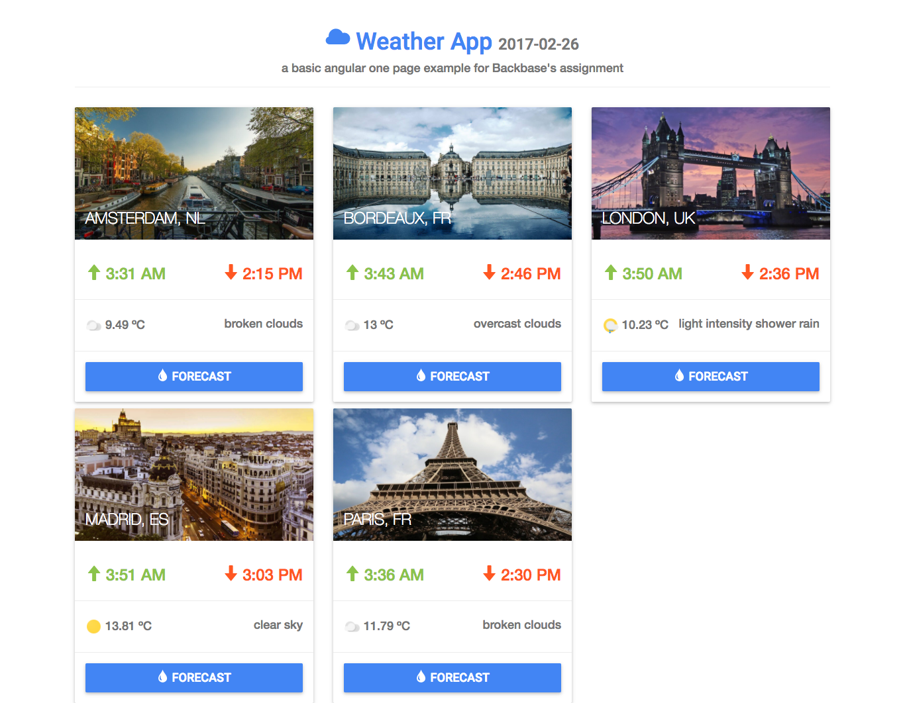
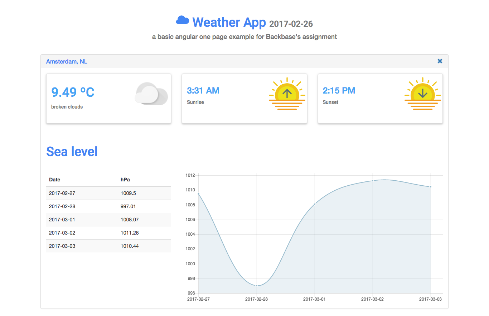

# weather-example
> A weather app example for Backbase assignment.

> [Rodrigo Ruiz Díaz, Msc. Computer Engineer](mailto:rodrigo.ruizdiaz@reingenio.com.ar)

## Description
This weather example app is an assignment for Backbase.

It shows to user a list of 5 pre-defined cities. User can select one of them in order to get more data related and a chart in order to get a better representative way for data collected by API.

Project follows a basic MVC structure, using a factory ```apiService``` pattern in order to collect data from endpoints.

App iterates a list of cities from ```mainController```, and then returns data for user. When user selects one of these cities, app connects with ```apiService``` in order to get more relevant info about the forecast for this city (sea level principally).

Cities are pre-defined in controller, but it can be changed for any city.

Chart is filtering sea level data time to 9:00 a.m. in order to respect the exercise constraint.


__NOTE:__ This is a basic example without server and web-deployment (Grunt) tasks in order to load it easily just opening the file in a browser. Because these constraints include open this as a single web-app page (just opening ```index.html```), I can't use grunt tasks in order to deploy a php server and run some minified scripts (jshint, minify js, template js for html, ...). Anyway, I could explain you these deployment tasks if you request.

## How to run project
1. Install npm modules (dependencies). [You need to install NodeJS first](https://nodejs.org/) if you have not installed it.
> npm install

2. Open index.html file.

## Captures

### Main



### Amsterdam
